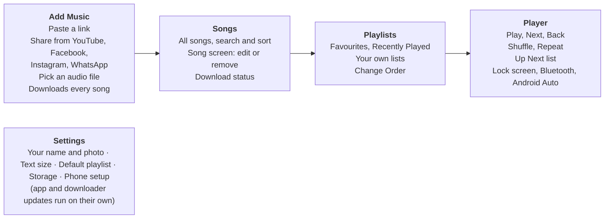
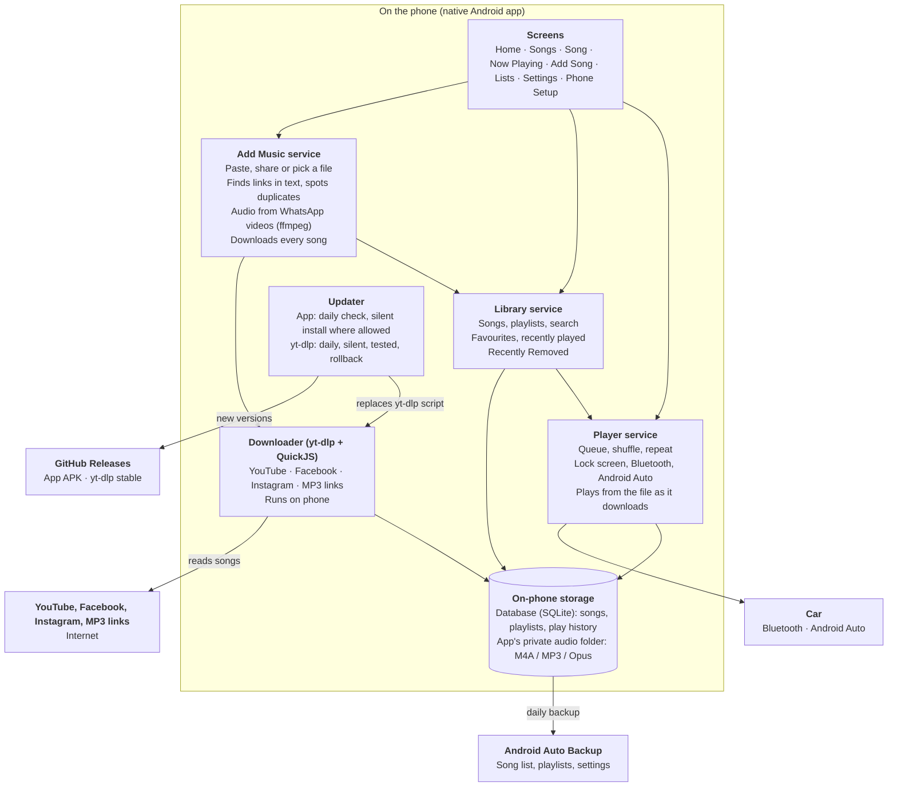
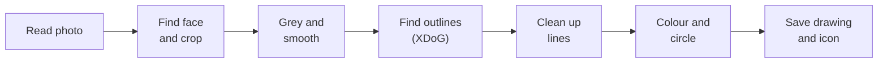

# My Music App — Requirements & High-Level Design

Last updated: 4 Oct 2026 · Harishankar

## 1. Purpose and user

A standalone Android music player that lets one person aged 60+ save songs they find online, keep them in simple playlists, and play them with one tap. Everything runs on the phone; there is no server.

**Primary user:** a 60-year-old listener on a Xiaomi / Redmi / Poco phone. Comfortable with WhatsApp and YouTube, not with settings menus. May have reduced eyesight, less precise taps, and little patience for errors or ads.

**Goals**

- Add a song by pasting or sharing a YouTube, Facebook or Instagram link or a direct MP3 link (also when the link sits inside a forwarded WhatsApp message), by sharing a song, video or voice note from WhatsApp, or by picking an audio file.
- Every added song is downloaded to the phone, so the whole library plays offline.
- Play any saved song within 2 taps of opening the app (Songs → Play).
- Feel personal: the app greets the user by name ("Murali's Music App") and shows their own photo, redrawn as a simple line drawing, as its logo.
- Never show ads, sign-ups, or recommendations the user did not ask for.

**Non-goals**

- Any server, account or cloud service built for this app. All features live on the device.
- Logging in to YouTube, Facebook, Instagram or any other site.
- iPhone, tablets, and Android versions before 15.
- Voice commands or spoken feedback, sleep timer, sound presets, casting, in-app help guides.
- Music discovery, streaming catalogues, social sharing, lyrics, podcasts.
- Saving whole YouTube playlists or live streams.
- Remote help from family, multiple users, languages other than English.
- Logs, crash reports or analytics of any kind.

## 2. Design principles for a 60+ user

Every screen does one job, uses big plain words, and forgives mistakes.

| Principle | What it means in the app |
| --- | --- |
| See it easily | Body text 20 sp minimum, titles 28 sp. Contrast 7:1 (WCAG AAA). Follows the phone's text-size setting, plus an app Text Size choice in Settings. Titles wrap; text is never cut off. |
| Hit it easily | Touch targets 64 × 64 dp minimum, 16 dp apart. Main Play button 96 dp. No swipe-only or long-press-only actions. |
| Words, not just icons | Every button has an icon and a text label ("Play", "Next", "Add Song"). No jargon like "queue", "sync", "buffer". |
| Few choices | One job per screen; its main action is the largest button, in the top half. Flat navigation: 3 bottom tabs and a labelled **Settings** button in the title bar; no hidden menus or hamburger icon. |
| Forgive mistakes | Removing a song or deleting a list asks first, then moves it to Recently Removed for 30 days, from where **Put Back** restores it. |
| Always know where you are | Large screen title on every page. A "Now Playing" bar is always visible at the bottom. |
| Plain messages | Short on-screen text ("Song saved on your phone", "No internet — this song will download later"). No error codes, no sounds or voice. |
| Remember everything | App reopens exactly where it stopped: same song, same position, paused. It never starts sound by itself. |
| Feels like their own | First launch asks "What is your name?" and for a photo. The app title becomes "Murali's Music App", and their photo, turned into a line drawing, becomes the logo in the title bar and on a home-screen shortcut. |

## 3. Feature map

The app has four areas the user touches daily and one settings area they rarely open.



Songs come in once through Add Music, live in Songs, get grouped into Playlists, and play in the Player. Settings sits underneath all four.

## 4. Functional requirements

Everything below ships in the first release; nothing is deferred.

### 4.1 First launch

| ID | Requirement |
| --- | --- |
| FL-1 | Welcome screen asks "What is your name?" with a large text box and two buttons: **Continue** and **Skip**. |
| FL-2 | With a name, the in-app title becomes "Murali's Music App"; skipped, it stays "My Music App". A long title wraps to 2 lines and is never cut off. The name can be changed in Settings. |
| FL-3 | Next screen asks "Add your photo?" with three buttons: **Take Photo**, **Choose Photo** and **Skip**. Take Photo opens the phone's camera app; Choose Photo uses Android's photo picker, so no camera or storage permission is needed. |
| FL-4 | The app finds the face in the photo, crops it to a circle and redraws it as a line drawing of its outlines (face shape, eyes, glasses, hair) in dark lines on a light background, using the steps in section 7, *Photo to line drawing*. If no face is found, it uses the middle of the photo. This runs on the phone in about 2 s; the photo never leaves it. |
| FL-5 | A preview shows the drawing large with **Use This** and **Try Again**. Only the drawing is kept; the original photo is not stored. Skipped, the app uses its standard music-note logo. |
| FL-6 | The drawing appears as a 48 dp circle beside the app title in the title bar of every screen. |
| FL-7 | **Phone Setup** follows, one step per screen, each with a picture of what to tap, an **Open Settings** button that jumps to the right Android page, and **Skip**. When the user comes back, the app checks the result where Android allows it and shows a green tick. Steps: (1) **Allow updates** — let this app install its own updates ("Install unknown apps"); (2) **Keep music playing** — battery set to "No restrictions"; (3) on Xiaomi / Redmi / Poco only, **Autostart** on; (4) only if Android Auto is installed, **Use in the car** — written, numbered steps to turn on Android Auto's "Unknown sources" (Android Auto has no direct link to this page). The same steps can be run again from Settings → Phone Setup. |
| FL-8 | After setup, Home shows the card "Put your picture on the home screen?" with **Add** and **No thanks**. **Add** asks Android to place a home-screen shortcut whose icon is the drawing; Android asks for one confirmation tap. Its short label is "Murali's Music" when that is 12 characters or fewer, otherwise the name alone ("Murali"); its long label is "Murali's Music App". The shortcut opens the app as normal. |
| FL-9 | The app's own icon and label in the app list stay the standard logo and "My Music App"; Android does not let an installed app change its own icon or name. The home-screen shortcut is how the photo reaches the home screen. |
| FL-10 | Changing the name or photo in Settings (SET-3) updates the title bar and the home-screen shortcut straight away. |
| FL-11 | The very first install (downloading the APK and letting the browser or file manager install it) happens before the app exists, so the app cannot guide it. A one-page install guide with pictures lives in the GitHub repo's README. |

### 4.2 Home

| ID | Requirement |
| --- | --- |
| HOME-1 | The title bar shows the drawing, the personalised title and a labelled **Settings** button. The three tab screens (Home, Songs, Add Song) have it; other screens show **Back** instead. |
| HOME-2 | One big Play button. When the user left a song part-way, it reads "Continue: \<song\>" and resumes the same queue. Otherwise it plays the default playlist and reads "Play Favourites" (or that list's name). |
| HOME-3 | Below it, big list tiles: Favourites, All Songs, Recently Played, the user's own lists, and **+ New List**. |
| HOME-4 | At most one card is shown at a time, highest first: (1) "A new version is ready — Install" (UPD-3); (2) "Music may stop when the screen is off — Finish Setup" when a Phone Setup step the app can check is off; (3) "5 songs from WhatsApp or files couldn't be moved to this phone" with **See Names** and **OK** (SET-6); (4) "Tap Add Song to save your first song" on an empty library; (5) "Put your picture on the home screen?" (FL-8). Each card goes away once done or dismissed, and the next one shows. |
| HOME-5 | The home-screen picture card is not shown on launchers that do not support pinned shortcuts. |

### 4.3 Add music

| ID | Requirement |
| --- | --- |
| ADD-1 | "Add Song" screen has one large **Paste Link** button that reads the clipboard; no typing needed. |
| ADD-2 | App appears in Android's **Share** menu. Sharing from YouTube, YouTube Music, Facebook, Instagram, WhatsApp, Messages or email opens Add Song with a preview card (picture, title, source, length) and one big **Save Song** button. |
| ADD-3 | Pasted or shared text may contain other words; the app finds the supported links inside it ("Listen to this 🙏 https://youtu.be/…"). With several links, it shows one preview card per link, each with a tick box (all ticked), and one button "Save 3 Songs". With none: "No song link found in this message." |
| ADD-4 | Supported links: youtube.com (videos and Shorts), youtu.be, music.youtube.com, facebook.com and fb.watch (public videos and reels), instagram.com public reels and posts (best effort; see ADD-6), and direct links ending in .mp3 or .m4a. A video link with a playlist part (`watch?v=X&list=Y`, including Mix and radio links) saves only video X. Playlist-only links, live streams and other sites show "This link is not supported." |
| ADD-5 | Links are read and downloaded on the phone by the built-in downloader (yt-dlp). Title, artist, picture and length fill in automatically; the user can change the name and artist later on the Song screen. |
| ADD-6 | Private, friends-only or login-required Facebook and Instagram videos show "This video is private and can't be saved." The app never asks for a login. Instagram often refuses downloads without a login, so many Instagram links will end up here. |
| ADD-7 | Recordings over 1 hour ask first: "This is a long recording (2 h 10 min, about 150 MB). Save it?" with **Save** and **Cancel**. |
| ADD-8 | **WhatsApp:** sharing an audio file, a voice note or a video file from WhatsApp adds it as a song through the same preview card, titled with the file name. For a video, only the audio track is kept, copied without re-encoding by the bundled ffmpeg and saved as M4A. A voice note is titled "Voice note · 4 Oct" until renamed. |
| ADD-9 | **Pick a File** adds MP3 / M4A / AAC / Opus files from phone storage, including WhatsApp's saved media. |
| ADD-10 | Every added link downloads automatically at the highest audio-only quality the source offers, over any connection (Wi-Fi or mobile data). Progress shows as "Downloading 40%". |
| ADD-11 | A song can be played straight away: playback reads from the file as it downloads, so each song uses mobile data only once. Sound may start a few seconds later than true streaming. |
| ADD-12 | **Can't download now** (no internet, site not working, phone full): the song shows "Will download later" and retries on its own when the phone is back online, for up to 7 days. After that it shows "Can't be saved" with **Try Again** and **Remove**. |
| ADD-13 | **Can never download** (private, removed from the site, not supported): no retries; the song shows "Can't be saved" with **Remove**. |
| ADD-14 | **Duplicates:** a link is matched by the site's video ID (so youtu.be, youtube.com and music.youtube.com links to one video match), a file by a fingerprint of its contents. A match shows "This song is already in your library" with a **Play** button. If the match is in Recently Removed, it is put back instead and shows "Song put back in your library". |
| ADD-15 | If a video is later removed from YouTube, Facebook or Instagram, the downloaded copy keeps playing from the phone. |

### 4.4 Songs

| ID | Requirement |
| --- | --- |
| LIB-1 | **Songs** tab: a search box at the top, sort buttons, then every song as a large row with picture, title, artist and a Play button. |
| LIB-2 | Search by typing; results update as letters are typed and match title and artist. |
| LIB-3 | Sort by **A–Z**, **Newest** or **Most Played**. A play counts once 30 s have played, or half the song if it is shorter. |
| LIB-4 | Each song shows its state: "On your phone", "Downloading 40%", "Will download later" or "Can't be saved". |
| LIB-5 | **Song screen:** tapping a song's name (in Songs, any list, or **Song Details** on Now Playing) opens it: big picture, title, artist, state and length, and the buttons **Play**, **Favourite** (or **Remove from Favourites**), **Add to List**, **Edit Name** (title and artist) and **Remove**. |
| LIB-6 | **Remove** asks "Remove this song?", then moves it to **Recently Removed** for 30 days. It leaves every list and Up Next; if it is playing, the next song starts. After 30 days its audio file is deleted. |
| LIB-7 | **Recently Removed** (in Settings → Storage) lists removed songs and lists, each with **Put Back**. A song goes back to the library and to every list it was in, at the same place where possible. **Empty Now** asks "Delete these for good?" and frees the space at once. |

### 4.5 Playlists

| ID | Requirement |
| --- | --- |
| PL-1 | Built-in lists that cannot be deleted: **All Songs**, **Favourites** and **Recently Played** (the last 50 different songs played, newest first). |
| PL-2 | Favourites is a normal list: **Favourite** on the Song screen or Now Playing adds or removes a song, and Change Order works. |
| PL-3 | Create, rename and delete own lists. A list's tile shows its first song's picture on a colour the app picks from a fixed set of high-contrast colours; an empty list shows a music note on its colour. Deleting asks "Delete this list? Songs stay in your library." and moves the list to Recently Removed for 30 days. |
| PL-4 | Add a song to a list from the Song screen via **Add to List**, then tap a big list tile. |
| PL-5 | **Change Order** shows **Move Up / Move Down** buttons on each row of Favourites and own lists; drag is optional, never the only way. All Songs follows its sort; Recently Played follows play time. |
| PL-6 | One song can sit in many lists; removing it from a list never deletes it from the library. |
| PL-7 | **Default playlist** is Favourites unless changed in Settings. If the chosen list is deleted, it goes back to Favourites. If it is empty, the Home button plays All Songs and reads "Play All Songs". |

### 4.6 Player

| ID | Requirement |
| --- | --- |
| PLY-1 | Play / Pause, Next, Previous, and a seek bar with a large handle plus **Back 10 s / Ahead 10 s** buttons. |
| PLY-2 | Tapping Play on a song plays it and then the rest of the list it was tapped in: that playlist, or in Songs the current sort or search results. **Play All** and **Shuffle** on a list do the same from its start. |
| PLY-3 | Shuffle and Repeat (Off / All / One), labelled in words, apply to the current songs. |
| PLY-4 | The in-app volume slider moves the phone's media volume, the same as the phone's volume buttons. |
| PLY-5 | Keeps playing with the screen locked; controls on lock screen, notification, Bluetooth headset and Bluetooth car stereo. |
| PLY-6 | **Android Auto:** the car screen shows Favourites, the user's lists, All Songs and Recently Played to browse and play, plus the normal player controls. Needs Android Auto's "Unknown sources" setting (FL-7 step 4). |
| PLY-7 | Pauses on headphone or Bluetooth disconnect and on phone calls; resumes after a call ends. |
| PLY-8 | **Up Next** list: view, remove or move songs in the current queue. |
| PLY-9 | Reopens paused at the same song and position with the same Up Next, Shuffle and Repeat. It never starts playing by itself and never changes the phone's volume. |

### 4.7 Settings and backup

| ID | Requirement |
| --- | --- |
| SET-1 | Opened from the **Settings** button in the title bar. Five items: Your Name and Photo, Text Size, Default Playlist, Storage (space used + Recently Removed), Phone Setup. |
| SET-2 | **Text Size:** **Normal**, **Large** or **Extra Large** (× 1.0, × 1.25, × 1.5), applied on top of the phone's own text size and capped at 2 × overall so nothing is cut off. A sample song row updates as the user taps. |
| SET-3 | **Your Name and Photo** shows the name and the current drawing large, with four buttons: **Change Name**, **Take New Photo**, **Choose New Photo** and **Remove Photo**. A new photo goes through the same drawing and preview as first launch (**Use This** / **Try Again**); the old drawing stays until **Use This** is tapped. **Remove Photo** asks "Remove your photo?" and goes back to the music-note logo, in the title bar and on the home-screen shortcut. |
| SET-4 | **Storage** shows space used by songs and opens Recently Removed. Under 1 GB free on the phone, it and the Add Song screen show "Your phone is nearly full". |
| SET-5 | Android Auto Backup saves the song list, playlists, settings and the photo drawing (a small image) to the user's Google account (under its 25 MB limit). Audio files, pictures and downloader files are excluded. |
| SET-6 | On a new phone, the restored list re-downloads every song that came from a link. Songs from WhatsApp or files cannot be restored (no link, and their audio is not backed up); they are left out of the library and lists, and Home shows one card naming them (HOME-4). |

### 4.8 Updates

The app and the downloader update separately. Site fixes reach the phone silently through downloader updates; app updates install silently where Android allows.

| ID | Requirement |
| --- | --- |
| UPD-1 | The APK is downloaded from the project's GitHub Releases page; no app store. |
| UPD-2 | **App updates:** on launch (at most once a day) the app checks the project's GitHub Releases for a newer APK and downloads it in the background. |
| UPD-3 | When ready and no music is playing, the app installs the update without asking, using Android's "no user action" install, then shows "App updated" once. Where Android still asks (for example the first update after a browser install), Home shows "A new version is ready — Install" and Android asks for one confirmation tap. |
| UPD-4 | **Downloader updates:** once a day the app checks yt-dlp's GitHub Releases (stable channel) and downloads a newer version silently. No install tap and no message to the user. |
| UPD-5 | A new downloader version must first match the SHA2-256SUMS file published with the release. Then the new and current versions each read 3 stable test links (YouTube, YouTube Music, Facebook; details only, no download). The new version is used if it reads at least as many as the current one, so a fix still lands while a site is broken for both. |
| UPD-6 | The previous downloader version is kept. If new songs fail 3 times in a row for site reasons (not no internet, private or removed videos) and the previous version can still read the test links, the app switches back and skips the failing release until a newer one is out. |
| UPD-7 | Each APK ships with a bundled yt-dlp version and the QuickJS script engine, so adding songs works before the first downloader update. |
| UPD-8 | Songs, playlists and settings are kept across all updates. |

## 5. Key screens

Eight screens cover everything the user does; each has one main button, shown in the accent colour. Phone Setup (first launch and Settings) is a series of single-step screens and is not drawn here.

```text
+----------------------------------+   +----------------------------------+
| (o) Murali's Music     [Settings]|   | (o) Murali's Music     [Settings]|
|     App                          |   |     App                          |
| +------------------------------+ |   | Songs                            |
| | (>)  Continue: Song title    | |   | +------------------------------+ |
| +------------------------------+ |   | | Search: type a name...       | |
| My Lists                         |   | +------------------------------+ |
| +-------------+ +--------------+ |   | Sort [A-Z] [Newest] [Most Played]|
| | Favourites  | | All Songs    | |   | [img] Song title 1          (>)  |
| +-------------+ +--------------+ |   |       Artist name                |
| +-------------+ +--------------+ |   | [img] Song title 2          (>)  |
| |Recently Plyd| | + New List   | |   |       Artist · Downloading 40%   |
| +-------------+ +--------------+ |   | [img] Song title 3          (>)  |
|                                  |   |       Artist · Download later    |
|                                  |   | [Now playing: Song 1     Pause ] |
| [Now playing: Song title  Play ] |   |----------------------------------|
|----------------------------------|   |   Home     *Songs*    Add Song   |
|  *Home*     Songs     Add Song   |   +----------------------------------+
+----------------------------------+                  SONGS
                HOME

+----------------------------------+   +----------------------------------+
| < Back            Song           |   | < Back        Now Playing        |
|            +----------+          |   |            +----------+          |
|            | Picture  |          |   |            | Picture  |          |
|            +----------+          |   |            +----------+          |
|           Song title             |   |           Song title             |
|           Artist name            |   |           Artist name            |
|       On your phone · 4:05       |   | =======O------------------------ |
| +------------------------------+ |   | 1:20                        4:05 |
| |          (>) Play            | |   | [Back 10 s]         [Ahead 10 s] |
| +------------------------------+ |   |    (|<)        ( || )      (>|)  |
| [  Favourite  ] [ Add to List  ] |   |  Previous      Pause       Next  |
| [  Edit Name  ] [    Remove    ] |   | [Shuffle: Off]    [Repeat: All]  |
|                                  |   | [Up Next]       [Song Details]   |
| [Now playing: Song 1     Pause ] |   | Volume  ---------O------------   |
|----------------------------------|   +----------------------------------+
|   Home     *Songs*    Add Song   |               NOW PLAYING
+----------------------------------+
                SONG

+----------------------------------+   +----------------------------------+
| (o) Murali's Music     [Settings]|   | < Back         Favourites        |
|     App                          |   | +-------------+ +--------------+ |
| Add a Song                       |   | |  Play All   | |   Shuffle    | |
| +------------------------------+ |   | +-------------+ +--------------+ |
| |          Paste Link          | |   | [img] Song title 1          (>)  |
| |   Uses the link you copied   | |   |       Artist name                |
| +------------------------------+ |   | [img] Song title 2          (>)  |
| +------------------------------+ |   |       Artist name                |
| |         Pick a File          | |   | [img] Song title 3          (>)  |
| | Song from phone or WhatsApp  | |   |       Artist name                |
| +------------------------------+ |   | [     Change Order      ]        |
| + - - - - - - - - - - - - - - -+ |   |                                  |
| | [img] Song title found       | |   | [Now playing: Song 1     Pause ] |
| |       From YouTube · 4:05    | |   |----------------------------------|
| |       [  Save Song  ]        | |   |  *Home*     Songs     Add Song   |
| + - - - - - - - - - - - - - - -+ |   +----------------------------------+
|----------------------------------|                 PLAYLIST
|   Home      Songs    *Add Song*  |
+----------------------------------+
              ADD SONG

+----------------------------------+   +----------------------------------+
| < Back           Settings        |   | < Back          Text Size        |
| +------------------------------+ |   | +------------------------------+ |
| | (o) Your Name and Photo      | |   | |  ( ) Normal                  | |
| |     Murali                   | |   | +------------------------------+ |
| +------------------------------+ |   | +------------------------------+ |
| | Text Size                    | |   | |  (o) Large                   | |
| |     Large                    | |   | +------------------------------+ |
| +------------------------------+ |   | +------------------------------+ |
| | Default Playlist             | |   | |  ( ) Extra Large             | |
| |     Favourites               | |   | +------------------------------+ |
| +------------------------------+ |   | Sample:                          |
| | Storage                      | |   | [img] Song title 1          (>)  |
| |     2.1 GB used · 3 removed  | |   |       Artist name                |
| +------------------------------+ |   +----------------------------------+
| | Phone Setup                  | |                TEXT SIZE
| |     All done                 | |
| +------------------------------+ |
+----------------------------------+
              SETTINGS
```

- Three bottom tabs only: **Home**, **Songs**, **Add Song**. Tapping the Now Playing bar opens the full player. **Settings** sits in the title bar of the three tab screens.
- The main action sits in the top half of the screen and is the largest button there.
- The title wraps to 2 lines when the name is long, as drawn; it is never shortened.
- Home shows the personalised title from first launch, with the user's photo drawing `(o)` beside it. The Add Song preview card appears only after a link is pasted or shared; one more tap saves and downloads it.
- Songs shared from WhatsApp open the same preview card with the file name as the title.
- Tapping a song's name anywhere opens the Song screen; tapping its `(>)` plays it.
- Sizes in the sketch are relative. On the phone, body text is 20 sp and buttons at least 64 dp tall (section 2).

## 6. Non-functional requirements

| Area | Requirement |
| --- | --- |
| Platform | Android 15+ phones, portrait only. No tablet, iPhone or older-Android support. |
| Target phone | Xiaomi / Redmi / Poco on HyperOS is the main target. Downloads and playback must survive its background limits once Phone Setup is done. |
| Standalone | No server, account or backend of our own. The only network use: reading and downloading links, the two GitHub update checks (app and yt-dlp), the downloader test links, and Android Auto Backup. |
| Credentials | None in the app: no API keys, no YouTube, Facebook or Instagram login. The project's GitHub repo is public so the update check needs no token. |
| Distribution | APK downloaded from a GitHub Releases page and updated from there (section 4.8). Google Play does not allow apps that download from YouTube or that download code such as yt-dlp. |
| Licence | GPL-3.0, as required by youtubedl-android. The repo describes the app as a personal music player, without "YouTube downloader" wording. |
| App size | About 40–45 MB, arm64 only, because the downloader bundles Python, ffmpeg and QuickJS. |
| Accessibility | WCAG 2.2 AAA contrast; works with TalkBack and with phone text size × app Text Size up to 200% without cut-off text. |
| Ease of use | A first-time user adds and plays a song in under 2 minutes with no help. Tested with at least 3 people aged 60+. |
| Speed | App opens to Home in under 2 s. Saved songs start in under 1 s. A newly added song starts playing in under 10 s on 4G (yt-dlp starts Python first, and playback reads the file as it downloads); the exact target is set after the prototype. |
| Data use | Each song is downloaded once; playing it while it downloads uses no extra data. |
| Offline | The whole library, playlists and search work with no internet. |
| Storage | Audio is kept in the app's private folder. Sized for up to 500 songs at maximum audio quality (about 3 GB at 160 kbps). Shows space used; warns when the phone has under 1 GB free. |
| Reliability | No crash or data loss across app or downloader updates; playback survives screen lock for 8+ hours. |
| Privacy | No ads, no tracking, no analytics, no logs or crash reports. Data stays on the phone and in the user's own Google backup. The user's photo is redrawn on the phone and only the drawing is kept. |
| Language | English only. |

## 7. Architecture and data model

A single offline-first Android app with no server of its own; the internet is used only to read and download links, check GitHub for app and downloader updates, and for Android's built-in backup.



Screens call three services. Songs and lists live in an on-phone database; saved audio sits in the app's private folder. All site-specific code lives in yt-dlp, so a broken site is fixed by a silent downloader update instead of a new APK.

**Suggested stack**

| Layer | Choice | Why |
| --- | --- | --- |
| App | Kotlin + Jetpack Compose | Android only, so native gives the smallest, fastest app and full TalkBack support. |
| Audio | Media3 ExoPlayer + MediaLibraryService | Plays files, including one still being written; background play, lock-screen, notification, Bluetooth controls, and the browse tree Android Auto needs. |
| Site downloads | yt-dlp (Unlicense) via youtubedl-android (GPL-3.0), with QuickJS as yt-dlp's JavaScript engine | Reads YouTube, Facebook, Instagram and 1,000+ sites on the phone; bundles Python and ffmpeg; has a built-in updater for the yt-dlp script. QuickJS is under 1 MB and covers YouTube's newer JavaScript checks. |
| WhatsApp videos | Bundled ffmpeg (`-vn -c:a copy`) | Already in the app through youtubedl-android; copies the audio track out without re-encoding. |
| Duplicates | Site video ID from yt-dlp; SHA-256 of file contents | Matches the same video across link forms and the same file shared twice. |
| Photo drawing | Android's built-in face finder (`FaceDetector`) + an XDoG line-drawing filter written in Kotlin (see *Photo to line drawing* below) | Runs on the phone with no new library, model or download, so app size stays the same. |
| Home-screen picture | Android ShortcutManager (pinned shortcut) | The only way to put a custom picture and name on the home screen; updates in place when the photo or name changes. |
| Database | Room (SQLite) | Works offline; fast search over hundreds of songs. |
| Downloads | WorkManager | Runs in the background on any connection, retries when back online, survives restarts. |
| App updates | GitHub Releases API + Android PackageInstaller with `setRequireUserAction(USER_ACTION_NOT_REQUIRED)` | Finds and downloads the newest APK; installs without a tap where Android allows, otherwise asks once. |
| Phone Setup | `PackageManager.canRequestPackageInstalls()`, `PowerManager.isIgnoringBatteryOptimizations()`, settings intents | Checks and opens the Android pages for the setup steps. Xiaomi Autostart and Android Auto's Unknown sources cannot be checked by an app. |
| Backup | Android Auto Backup with `dataExtractionRules` | Built into Android; no code or account of our own. Rules exclude audio, pictures and downloader files. |

**Photo to line drawing**

The photo becomes an outline drawing in seven steps, all on the phone, on a background thread while the screen shows "Making your drawing…". It uses XDoG (eXtended Difference of Gaussians), a well-known method for turning photos into clean ink-style lines. Plain edge detection such as Canny gives broken, noisy lines in hair and skin, so it is not used.



| Step | What happens | Details |
| --- | --- | --- |
| 1. Read photo | Load the chosen or taken photo upright and shrink it. | `ImageDecoder` (applies the photo's rotation); longest side scaled to 1024 px. A camera photo goes to a temporary file in the app's cache. |
| 2. Find face and crop | Find the face and cut a square around it. | `android.media.FaceDetector` on an RGB\_565 copy. Take the largest face; crop a square centred just above the eye midpoint, about 4.5 × the eye distance wide, so hair and chin fit. No face found: the centre square of the photo. |
| 3. Grey and smooth | Turn it grey, even out the light and remove skin texture. | Scale to 512 × 512 px; grey = 0.299 R + 0.587 G + 0.114 B. Stretch contrast so the 2nd–98th percentile spans black to white. Two passes of an edge-preserving (bilateral) blur, 5 × 5, so outlines stay sharp while wrinkles and noise fade. |
| 4. Find outlines (XDoG) | Mark where brightness changes sharply: the edges of face, eyes, glasses, hair. | Blur the grey image twice: G₁ with radius σ and G₂ with radius k·σ. D = G₁ − τ·G₂. Each pixel's ink level = 1 (paper) if D ≥ ε, else 1 + tanh(φ·(D − ε)). Starting values on a 0–1 scale: σ = 1.2 px, k = 1.6, τ = 0.98, ε = −0.005, φ = 100, tuned on real photos in the prototype. Flat areas stay white whatever their brightness, so the result is outlines, not shading. |
| 5. Clean up lines | Remove specks and make lines bold enough to see. | Pixels below 0.5 count as ink. Drop ink blobs smaller than about 40 px. Thicken lines by 1 px for the 512 px drawing; for the icon version run step 4 with σ = 2.0 and thicken by 2 px, so lines survive at small icon size. |
| 6. Colour and circle | Draw dark ink on light paper inside a circle. | Ink #1A1A1A on warm white #FAF7F0 (well above 7:1 contrast), circular mask and a thin dark ring around the edge. |
| 7. Save drawing and icon | Keep only the drawing; throw the photo away. | Save a 512 px PNG (title bar, Settings, preview) and a 432 px adaptive-icon PNG with the drawing inside the centre 66 % safe zone (home-screen shortcut, via `Icon.createWithAdaptiveBitmap`). Delete the temporary camera file and release the photo from memory. |

The filter is about 200 lines of Kotlin using separable blurs, so a 512 px image takes well under a second on a mid-range Android 15 phone. If the prototype shows the drawings look poor, a small on-device line-art model (TensorFlow Lite, about 5 MB) can replace steps 3–4 at the cost of app size.

**Data model**

| Entity | Key fields |
| --- | --- |
| Song | id, title, artist, source\_type (youtube / facebook / instagram / mp3\_link / whatsapp / file), source\_url, source\_id (site's video ID), file\_hash (SHA-256), file\_path, file\_size, download\_status (queued / downloading / waiting\_retry / done / failed), failure\_reason (private / removed / unsupported / gave\_up), first\_failed\_at, duration, thumbnail\_path, added\_at, play\_count, last\_played\_at, removed\_at |
| Playlist | id, name, colour, built\_in (all\_songs / favourites / recently\_played / none), position, removed\_at |
| PlaylistSong | playlist\_id, song\_id, position. Rows stay while a song or list is in Recently Removed, so **Put Back** restores them. |
| PlayerState | current\_song\_id, position\_ms, queue (song ids), queue\_source (playlist id, or Songs with its sort or search), shuffle, repeat |
| Settings | user\_name, user\_photo\_drawing\_path, text\_size (normal / large / extra\_large), home\_shortcut\_added, default\_playlist\_id, dismissed\_cards, restore\_skipped\_songs, last\_app\_update\_check, ytdlp\_version, ytdlp\_previous\_version, ytdlp\_skipped\_version, ytdlp\_site\_failure\_streak, last\_ytdlp\_update\_check |

Favourites and own lists are Playlist rows with PlaylistSong entries; All Songs and Recently Played are built from Song (Recently Played: the 50 most recent `last_played_at`).

## 8. Decisions, risks and release plan

### Decisions (4 Oct 2026)

| Topic | Decision |
| --- | --- |
| Platform | Android 15+ phones only. Main target: Xiaomi / Redmi / Poco on HyperOS. Both trial users are on Android 15+. |
| Scope | Minimum feature set; everything in section 4 ships in the first release. |
| Navigation | Tabs: Home / Songs / Add Song. A labelled Settings button in the title bar. A Song screen holds Favourite, Add to List, Edit Name and Remove. No fixed limit on actions per screen. |
| Text size | Normal / Large / Extra Large in Settings, on top of the phone's setting, capped at 2 ×. |
| Downloader | yt-dlp on the phone for every site, with QuickJS bundled; it updates itself from yt-dlp's GitHub Releases, separately from app updates. A new version is tested against the current one before use. |
| Sites | YouTube (incl. Shorts) and YouTube Music, single videos only; Facebook public videos and reels; Instagram public reels and posts (best effort); direct .mp3 / .m4a links. Links are found inside any shared or pasted text. |
| WhatsApp | Audio files, voice notes and video files shared from WhatsApp; videos keep only their audio (bundled ffmpeg). |
| Adding songs | Preview card, then **Save Song**. Recordings over 1 hour ask first. Duplicates are matched by video ID or file fingerprint. |
| Songs from links | Play straight away from the file as it downloads (data used once), plus automatic download for offline play. |
| Downloads | Highest audio quality available, over any internet connection. Temporary failures retry for 7 days; permanent failures stop at once. |
| Player | Tapping a song queues the rest of that list. Reopens paused; Home shows "Continue". Volume slider moves the phone's media volume. |
| Car | Bluetooth controls and Android Auto browsing. |
| Playlists | Favourites is a normal list. List tiles use the first song's picture and an automatic colour. Default list falls back to Favourites, then All Songs. |
| Removing | Songs and lists go to Recently Removed for 30 days, with Put Back and Empty Now; re-adding a removed song puts it back. |
| Storage | Audio in the app's private folder. |
| Server and credentials | None. Every feature runs on the device; no API keys or site logins. |
| Distribution and updates | APK from a public GitHub Releases page, GPL-3.0, neutral wording. The app checks there and installs updates silently where Android allows. |
| Backup | Android Auto Backup of song list, playlists and settings. WhatsApp and file songs are not moved to a new phone; a card lists them. |
| Setup | In-app guided Phone Setup for app updates, battery, Xiaomi Autostart and Android Auto. The first APK install is covered by a README guide. |
| Diagnostics | None: no logs, crash reports or analytics. |
| Library size | Hundreds of songs, stored on the phone. |
| Language | English. |
| App name | "My Music App"; becomes "Murali's Music App" once the user enters their name. Long titles wrap to 2 lines. |
| Personal logo | The user's photo becomes a line drawing on the phone, shown in the title bar and on an optional home-screen shortcut. The installed app icon stays standard because Android cannot change it. |
| Outside help | None. A standalone, self-help app with no family or remote features. |

### Risks

- **Site terms:** YouTube's, Facebook's and Instagram's terms forbid downloading outside their own apps. The app is for personal use only and never published to an app store.
- **Public repo takedown:** a public repo that publishes a downloader APK can get a DMCA takedown, which would also stop app updates. Mitigated by neutral wording; keep copies of every APK and the signing key outside GitHub.
- **Site changes:** YouTube, Facebook and Instagram change their pages often, which breaks downloading. Downloaded songs keep playing; adding new songs resumes once yt-dlp publishes a fix, usually within days, and the phone picks it up silently.
- **yt-dlp on Android:** since late 2025, yt-dlp needs a separate JavaScript engine for full YouTube support. Plan: bundle QuickJS. If that fails in the prototype, fall back to NewPipe Extractor for YouTube only, with yt-dlp for the other sites; YouTube fixes would then need an app update.
- **Instagram:** Instagram often refuses downloads without a login, which the app will not ask for, so many Instagram links will show "can't be saved".
- **Facebook privacy:** many Facebook videos are not public and cannot be saved without a login.
- **Signing key:** Android installs an update only if it is signed with the same key as the installed app. Losing the key breaks auto-update and forces a reinstall that wipes the library. Back up the key file and its password.
- **First install:** the APK's very first install needs the browser or file manager to be allowed to install apps, before the app exists to guide it. Someone must follow the README guide once.
- **Silent updates:** Android installs without a tap only when this app is the installer of record, so at least the first update after a browser install will still ask for a tap.
- **Xiaomi background limits:** HyperOS stops background downloads and music unless Autostart and "No restrictions" battery are set. The app cannot check Autostart, and HyperOS updates sometimes reset these settings; when that happens the user may notice music stopping before the app can warn them.
- **No diagnostics:** with no logs, problems on the user's phone can only be found by reproducing them on a similar phone (Xiaomi, Android 15).
- **Android Auto:** Android Auto shows apps not installed from the Play Store only after its hidden developer mode is turned on (tap Version 10 times) and "Unknown sources" is switched on. The app can only show written steps; Android Auto updates may change this.
- **New phone:** songs from WhatsApp and files are not moved to a new phone, because they have no link and audio is not backed up.
- **Home-screen shortcut:** a few phone launchers do not support pinned shortcuts. On those the photo drawing shows only inside the app, and the Home card is not shown.
- **Drawing quality:** dim, blurry or busy photos give messy lines. The preview with Try Again lets the user retake it; tune the filter on real photos during the prototype.
- **Storage:** low space blocks new downloads. Mitigated by the 1 GB warning, the long-recording warning, and Recently Removed clean-up.

### To verify in a prototype

- yt-dlp via youtubedl-android, with QuickJS, reads and downloads a YouTube link and a Short on an Android 15 Xiaomi phone without extra setup.
- A public Facebook video and reel download correctly; check how often a public Instagram reel works without a login.
- Playing from a file while it downloads works for YouTube's audio formats; measure time from paste to first sound.
- The silent yt-dlp update, side-by-side test and rollback work end to end.
- The app updates itself without a tap on Android 15 / HyperOS, and with one tap after a browser install.
- Auto Backup restores the library for a sideloaded APK on a second phone, and link songs re-download.
- Downloads and 8+ hours of locked-screen playback survive on HyperOS once Phone Setup is done.
- Android Auto shows the app and its lists after "Unknown sources" is on.
- Final APK size (arm64 only).
- The photo drawing looks good on about 10 typical phone photos (indoor, outdoor, glasses, grey hair) and finishes in under 2 s.
- The pinned home-screen shortcut appears and updates on the target phone's launcher, and its label fits.

### Release plan

1. **Prototype:** the checks above, on a real Android 15 Xiaomi / Redmi / Poco phone.
2. **Build:** everything in section 4 as one release, published as an APK on GitHub Releases with the README install guide.
3. **Trial:** the user and 2 other people aged 60+ (both on Android 15+) use it for 2 weeks; watch where they hesitate, then fix.
4. **Maintain:** site fixes arrive silently through yt-dlp updates; publish a new APK only for app changes or when youtubedl-android itself must change.
